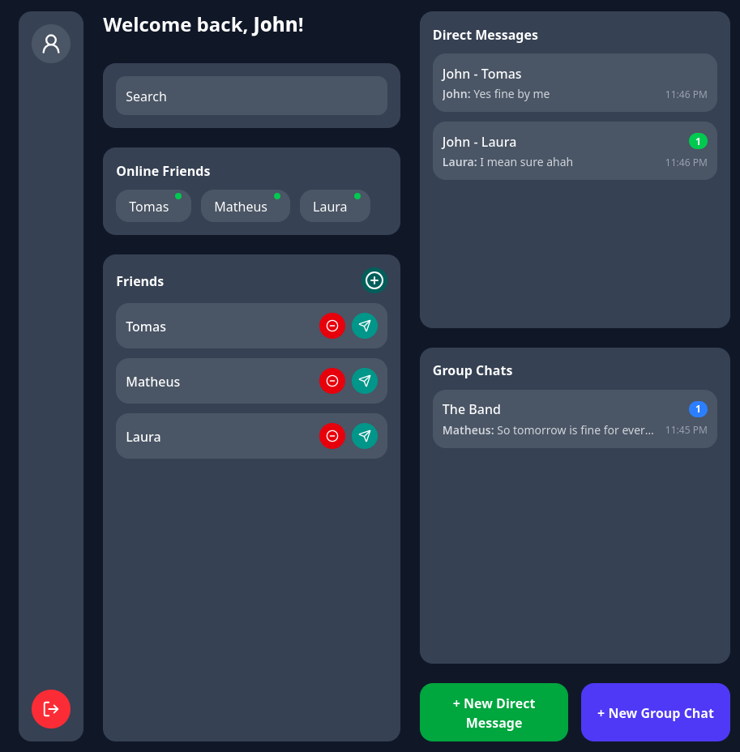
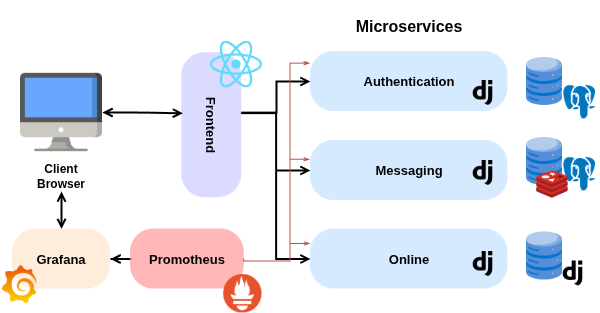
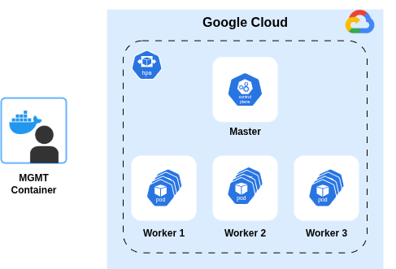

<div align="center">

# Microservices-based containerized Web Application on [Google Cloud Platform](https://cloud.google.com/products/ai?utm_source=google&utm_medium=cpc&utm_campaign=emea-pt-all-pt-dr-bkws-all-all-trial-b-gcp-1707574&utm_content=text-ad-none-any-DEV_c-CRE_548660716032-ADGP_Hybrid+%7C+BKWS+-+MIX+%7C+Txt+-+Infrastructure+-+Compute+-+Compute-KWID_902669552547-kwd-902669552547-userloc_1011743&utm_term=KW_google+m%C3%A1quina+virtual-NET_g-PLAC_&&gclsrc=aw.ds&gad_source=1&gad_campaignid=1400354526&gclid=CjwKCAjwmNLHBhA4EiwA3ts3mbfMb9wz-W2VdCORoWN2up_1HKjHgrfseqtlteTYOjViYGaIb6QXihoCyLMQAvD_BwE&hl=en)


#### AGISIT - Group 12
</div>

## Table of Contents
- [Description](#description)
- [Installation](#installation)
- [Usage](#usage)
- [Support](#support)
- [License](#license)

## Description
This project is a **simple Web Application built using a Microservices-based architecture**, designed to demonstrate a full modern DevOps workflow, including deployment, scaling, monitoring, and observability.

To interact with the application easily, a **web UI** is provided, offering a clear view of its features:



### Application Architecture
The application is composed of multiple microservices, each with its **own database** for better isolation and maintainability:

| Service          | Technology |
|-----------------|-----------|
| `authservice`    | [Django](https://www.djangoproject.com/)    |
| `messageservice` | [Django](https://www.djangoproject.com/)    |
| `onlineservice`  | [Django](https://www.djangoproject.com/)    |
| `frontend`       | [React](https://reactjs.org/)     |

To better illustrate how the services interact and the overall architecture, the diagram below provides a visual overview:



The application supports two deployment modes:  
1. **Local deployment** using containers (Docker Compose).  
2. **Kubernetes deployment**, fully self-hosted.  

### Infrastructure as Code (IaC)
Both the **Kubernetes cluster** and the **application deployment** are defined and managed via **IaC tools**. This ensures reproducible, automated infrastructure provisioning.  

### Scaling and Metrics
- The microservices are deployed with **automatic scaling**, based on CPU and memory usage.  
- Custom metrics have been implemented for the application, accessible under `/metrics` and `/health` endpoints.  
- **Liveness and Readiness Probes** are configured for all microservices, databases, and the frontend, ensuring that Kubernetes can properly manage service health.  

### Monitoring and Observability
- Metrics from the application and other resources are collected and visualized using **Prometheus** and **Grafana**.  
- A **Grafana dashboard** is automatically imported, providing **real-time performance monitoring** and health status.  
- This setup allows for **traceability and monitoring**, including load, response times, and error rates.  

### Key Features
- Microservices architecture with **isolated databases**.  
- **Local and Kubernetes deployment** options.  
- **IaC-based cluster and app provisioning**.  
- **Auto-scaling** based on CPU and memory.  
- **Custom application metrics** and health endpoints.  
- **Prometheus/Grafana monitoring** with preconfigured dashboards.  

This project showcases a full-stack deployment workflow that is fully self-contained, observable, and resilient.

## Installation

This project can be installed and run in **two different ways**:  

1. **Locally using Docker and Docker Compose**  
2. **On Google Cloud using Kubernetes and GitHub Container Registry (GHCR)**

---

### Option 1: Local Setup with Docker

**Prerequisites for Local Setup:**

- [Docker](https://docs.docker.com/get-docker/).

These tools are used to build and run the project containers locally.

---

### Option 2: Deployment on Google Cloud with Kubernetes

**Prerequisites for Cloud Deployment:**

- [Docker](https://docs.docker.com/get-docker/).
- [Just](https://github.com/casey/just).
- A **GitHub account** with permissions to create and push container images to GHCR.
- A **Google Cloud account** with permissions to create resources.

These tools are required to build container images, push them to GHCR, and deploy the application on Google Cloud.

To better understand how the application is deployed in the cloud, the diagram below illustrates the deployment architecture:



## Usage

### Running Locally with Docker

##### Start the Application

From the root of the project, navigate to the Docker directory:

```bash
cd Docker/
```

Then to build and start all containers:

```bash
docker compose up -d --build
```

Once the containers are running successfully, you can open the **Frontend (React App)** in your browser to interact with the application:

| Service | URL |
|----------|-----|
| **Frontend (React App)** | [http://localhost:5173](http://localhost:5173) |

All Django-based services automatically expose **metrics** at */metrics* and **health** checks at */health/*.

##### Stop and Clean Up

To stop all running containers and remove volumes:

```bash
docker compose down -v
```

This ensures a clean shutdown and resets all data for the next run.

### Deployment on Google Cloud with Kubernetes

This description explains how to deploy the application to **Google Cloud** using **Kubernetes** and **GitHub Container Registry (GHCR)**.

---

##### 1. Setting Up Google Cloud Project

##### Create a Project
1. Go to [Google Cloud Console](https://console.cloud.google.com/).
2. Select **NEW PROJECT** and give it a name.

##### Generating Google Cloud Credentials
1. Enable APIs and services for your project:
   - Navigate to **API & Services** → **Enabled APIs and Services**.
   - Search for **Compute Engine API**, select it, and click **ENABLE**.
   - Wait for the API to be enabled (may take a few moments).
2. Create or use an existing Service Account:
   - Go to **IAM & Admin** → **Service Accounts**.
   - Find the default Compute Engine service account.
   - Under **Actions**, select **Manage Keys**.
   - Click **Create new key**, select **JSON**, and download the credentials file.
3. Save the downloaded JSON file in the `terraform/` folder of the project. This file contains the keys required to access GCP resources.

##### Configuring Terraform Variables
- Edit `terraform-gcp-variables.tf` to set your project ID:

```hcl
variable "GCP_PROJECT_ID" {
    default = "<YOUR_PROJECT_ID>"
}
```

Edit `terraform-gcp-provider.tf` to specify the credentials JSON file:

```hcl
credentials = file("<YOUR_PROJECT_JSON>")
```

##### 2. Setting Up the GitHub Container Registry (GHCR)

Before deploying, you’ll need a **GitHub Personal Access Token (PAT)** with the following permissions:

- `write:packages`
- `read:packages`

This token allows you to push Docker images to GHCR.

Create a `.env` file in the **root directory** of the project and include your GHCR credentials:

```bash
# .env
GHCR_USERNAME=your_github_username
GHCR_TOKEN=your_github_personal_access_token
GHCR_EMAIL=your_email@example.com
```

> **Important:** If your GitHub username contains **uppercase letters**, make sure to enter it in **all lowercase** in the `.env` file (`GHCR_USERNAME`). GitHub Container Registry requires lowercase usernames for image paths.

#### 3. Building and Pushing Docker Images

Once the .env file is configured, all Docker images can be built and pushed to GHCR automatically. This can be accomplished either via the just command:

```bash
just build
```

The following images will be tagged and pushed under your GitHub username automatically:

- ghcr.io/<username>/frontend:latest
- ghcr.io/<username>/messageservice:latest
- ghcr.io/<username>/authservice:latest
- ghcr.io/<username>/onlineservice:latest
- ghcr.io/<username>/db:latest

##### 4. Deploying the Application to Google Cloud

Once all images have been successfully pushed to GHCR, deploy the system to your Kubernetes cluster by running:

```bash
just start
```

The deployment script automates infrastructure setup and application deployment on Google Cloud:

###### Steps

1. **Load environment variables**
   - Reads credentials from `.env`.

2. **Authenticate with Google Cloud**
   - Uses `gcloud auth login`.

3. **Provision infrastructure**
   - Terraform creates master and worker nodes.
   - Ensures SSH keys exist.

4. **Update Ansible inventory**
   - Dynamically updates `gcphosts` with instance IPs.

5. **Configure Kubernetes cluster**
   - Runs Ansible playbooks to install Kubernetes and join workers.
   - Deploys application manifests.
   - Installs NGINX Ingress Controller with fixed NodePorts (HTTP: `30080`, HTTPS: `30443`).
   - Creates GHCR image pull secret.

6. **Optional cleanup**
   - Prompt to delete deployment and destroy infrastructure.

##### 5. Accessing the Application

Once deployment is complete, the application’s external address will be displayed in the terminal:

    HTTP  : http://app.<worker-ip>.nip.io:30080
    HTTPS : https://app.<worker-ip>.nip.io:30443

#### 6. Optional Cleanup

After deployment, the script will prompt you whether you want to delete the deployment and destroy the infrastructure.  

If you choose `y`, it will automatically run the necessary Ansible and Terraform commands to remove resources.  

Once the cleanup is complete and you are back on the host machine, you can also run:

```bash
just stop
```

to stop any remaining local services or cleanup any leftover containers.

##### 7. Monitoring Dashboard (Grafana)

During deployment, a **Grafana** instance is automatically installed using the **Grafana Helm chart**.  
Grafana provides powerful visual dashboards for monitoring your microservices running on Kubernetes.

Once the deployment is complete, you can access Grafana at:

| Service     | URL                                                      |
|-------------|----------------------------------------------------------|
| **Grafana** | `http://app.<worker-ip>.nip.io:30080/grafana`<br>`https://app.<worker-ip>.nip.io:30443/grafana` |

> 🔹 Replace `<worker-ip>` with the IP address shown in your deployment output.  
> 🔹 Grafana credentials:  
> **Username:** `admin`  
> **Password:** `admin`

Grafana is preconfigured with a **Prometheus** data source, allowing you to view real-time metrics from all microservices and Kubernetes components immediately after deployment.

##### 8. Custom Application Metrics

In addition to the default metrics provided by **django-prometheus**, each microservice now exposes **custom domain-specific metrics** that reflect the operational and functional behavior of the messaging platform.

These metrics are automatically scraped by Prometheus and visualized in Grafana dashboards for real-time observability.

---

###### 🔸 Authentication Service (AuthService)

| Metric Name | Type | Description |
|--------------|------|-------------|
| `auth_login_success_total` | Counter | Total number of successful user logins. |
| `auth_login_failure_total` | Counter | Total number of failed login attempts. |
| `auth_registration_success_total` | Counter | Total number of successful user registrations. |
| `auth_registration_failure_total` | Counter | Total number of failed registration attempts. |

---

###### 🔸 Messaging Service (MessageService)

| Metric Name | Type | Description |
|--------------|------|-------------|
| `messages_sent_total` | Counter | Total number of messages successfully sent. |
| `messages_failed_total` | Counter | Total number of message send attempts that failed. |
| `groupchats_created_total` | Counter | Total number of group chats created. |

---

###### 🔸 Online Presence Service (OnlineService)

| Metric Name | Type | Description |
|--------------|------|-------------|
| `online_heartbeats_total` | Counter | Total number of heartbeat pings received. |
| `online_users_current` | Gauge | Current number of users marked as online. |

---

##### Health Checks

Each microservice in the cluster is monitored using **Kubernetes readiness and liveness probes**, which continuously check the container's health status.

- **Readiness probes** ensure that a pod is only added to the service load balancer once it’s ready to receive traffic.  
- **Liveness probes** automatically restart containers that become unresponsive or unhealthy.

---

### Benchmarking the Deployment

After the application is deployed on Google Cloud, you can perform load testing and measure performance using Locust, a modern and flexible load testing tool.

### 1. Install Locust

```bash
sudo apt install pipx -y
pipx ensurepath
pipx install locust
```

### 2. Run the Load Test

#### Interactive Web UI

```bash
locust -f locustfile.py -H http://<app-host>:30080
```

1. Open your browser at [http://localhost:8089](http://localhost:8089)
2. Set the following parameters:
   - **Number of users** (virtual clients)
   - **Spawn rate** (users per second)
   - **Run time** (optional)
3. Click **Start swarming**
4. Monitor the charts:
   - **Users vs Response Time**
   - **Requests per second (RPS)**
   - **Failure rate per endpoint**

## Support
If you encounter any issues or have questions about the project, you can contact the group via email:
- `leonor.figueira@tecnico.ulisboa.pt`
- `gabriel.parreiras@tecnico.uliboa.pt`
- `tom.romao@tecnico.ulisboa.pt`

## License
This project is licensed for academic use within the **AGISIT** course at **Instituto Superior Técnico**.

-----

Grade: 18.00/20.00
